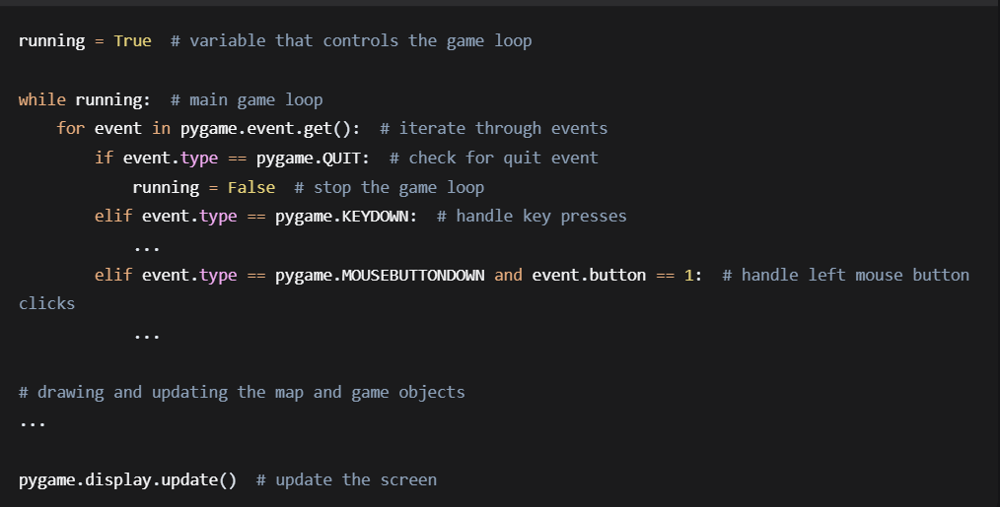
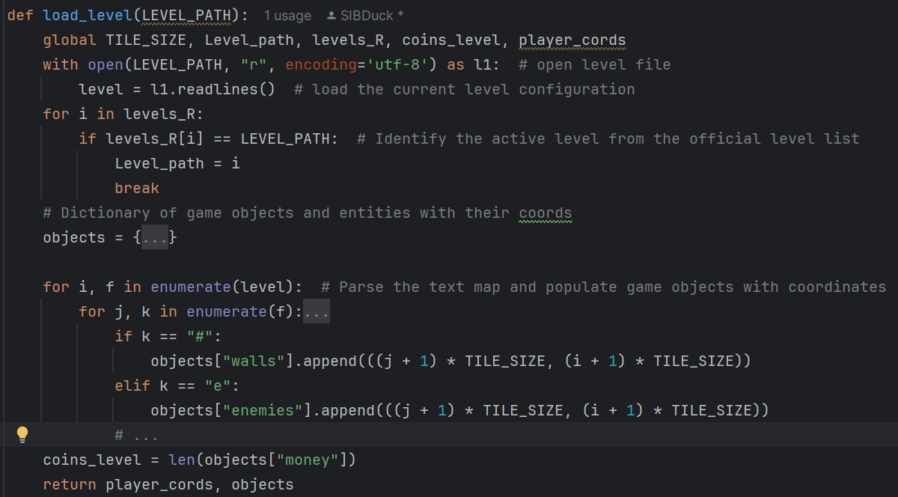
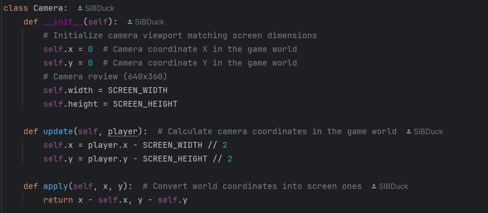
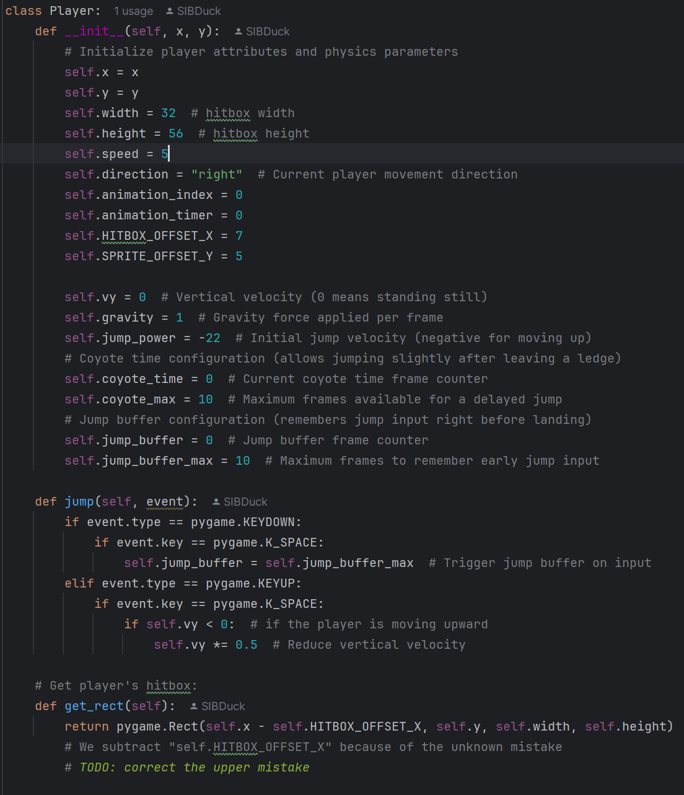
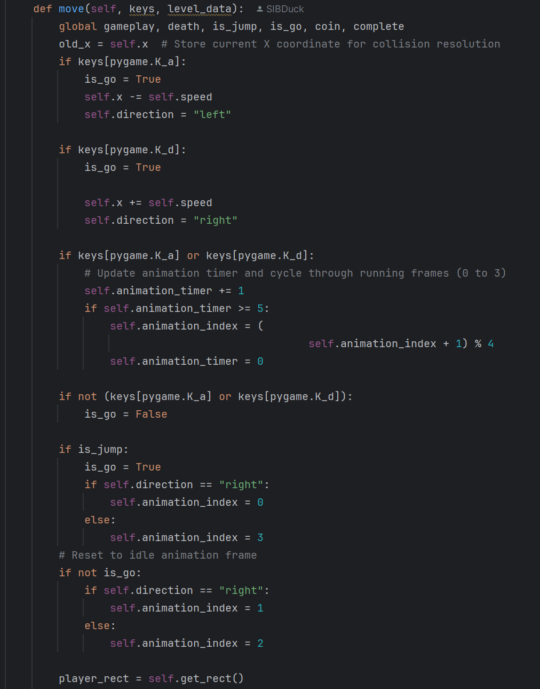
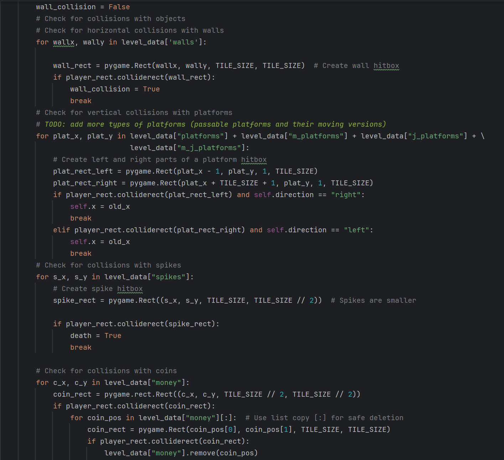
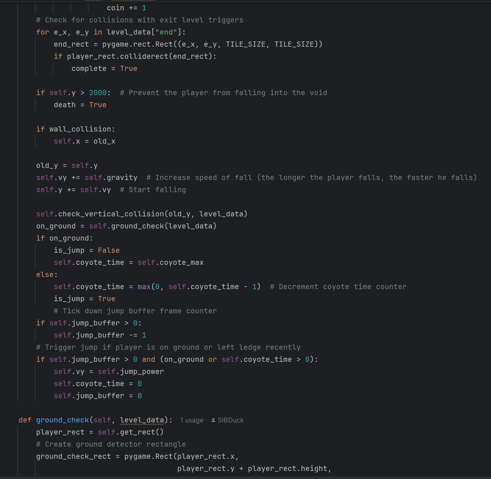
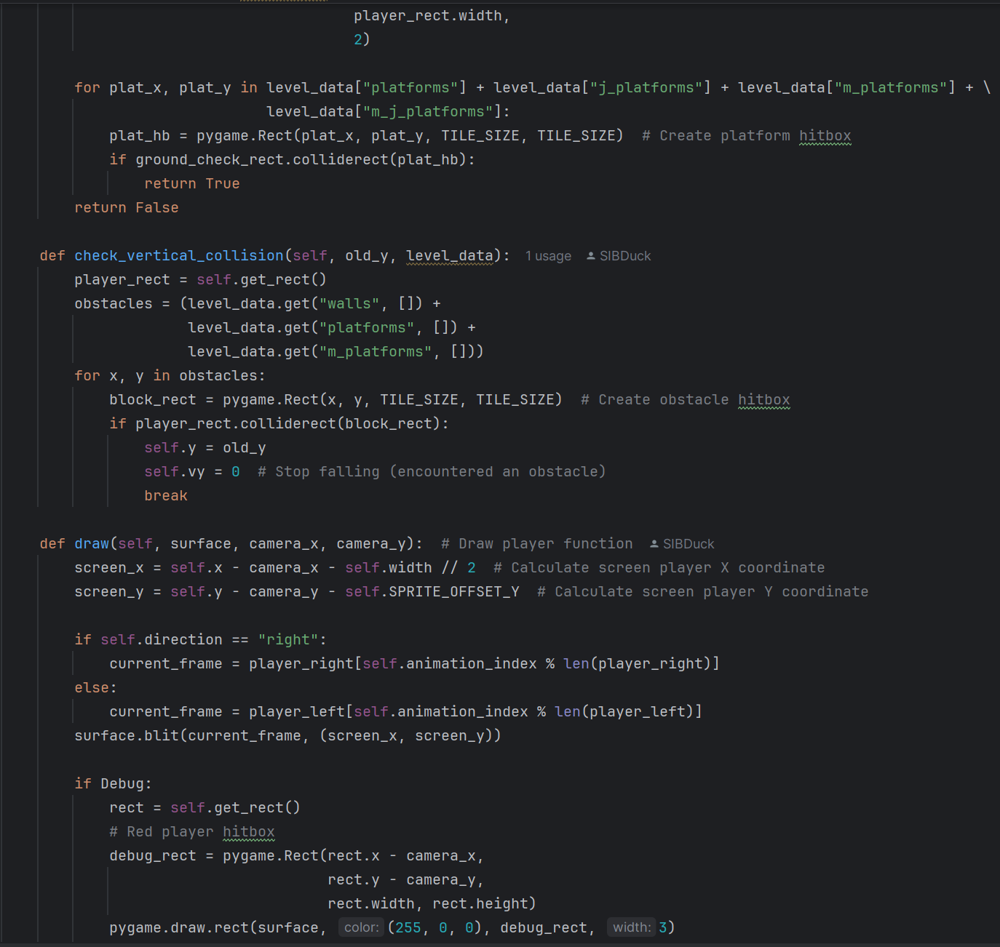
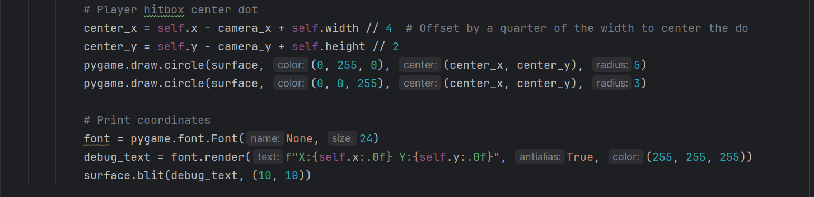
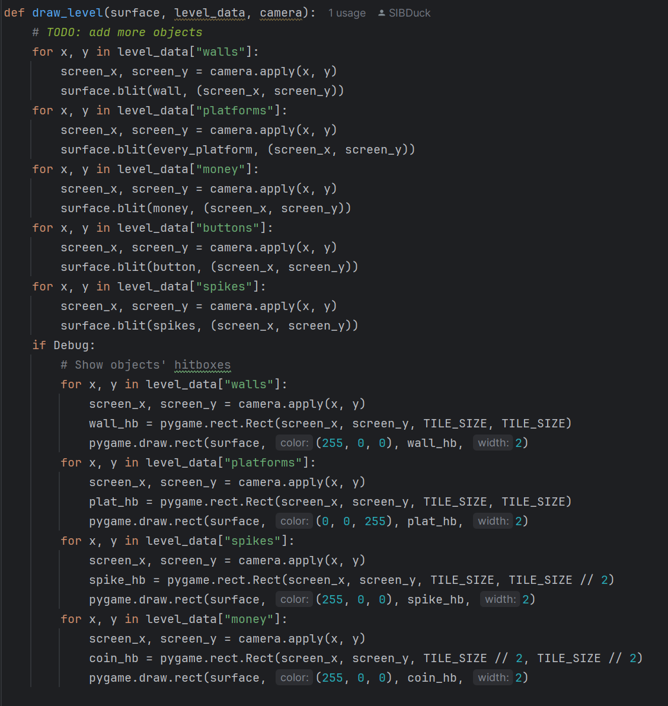

# The Reality of Developing an MVP Prototype by Beginners

**Author:** SIBDuck  

**Year:** 2026  

**Read Russian version:** [Russian/Русский](Documentation.ru.md)

# Table of Contents  

0. [Introduction](#introduction)  
1. [Section 1. Preparation for Prototype Development](#section-1-preparation-for-prototype-development)  

   [1.1 Choosing a Programming Language](#11-choosing-a-programming-language)  

   [1.2 Choosing a Development Environment](#12-choosing-a-development-environment)  

   [1.3 Choosing a Game Development Library](#13-choosing-a-game-development-library) 

   [1.4 Creating a Model of the Future Game](#14-creating-a-model-of-the-future-game)  

   [1.5 Analysis of Similar Games and Planned Prototype Features](#15-analysis-of-similar-games-and-planned-prototype-features)  
2. [Section 2. Prototype Implementation](#section-2-prototype-implementation)  

   [2.1 Project Architecture and Main Menu](#21-project-architecture-and-main-menu) 

   [2.2 Project Architecture and Level Loading](#22-project-architecture-and-level-loading)

   [2.3 Project Architecture and Player Physics / Camera Development](#23-project-architecture-and-player-physics--camera-development)  

     [2.3.1 Player Physics](#231-player-physics)  

     [2.3.2 Camera Mechanics](#232-camera-mechanics)  

   [2.4 Project Architecture and Rendering All Objects](#24-project-architecture-and-rendering-all-objects)  
3. [Testing and Evaluation of Prototype Readiness](#testing-and-evaluation-of-prototype-readiness)  
4. [Conclusion](#conclusion)  
5. [References](#references)  
6. [Links](#links)  
7. [Appendices](#appendices)  

   7.1. [Appendix 1. Game Loop Implementation](#appendix-1-game-loop-implementation)  

   7.2. [Appendix 2. Level Loader Implementation](#appendix-2-level-loader-implementation) 

   7.3. [Appendix 3. Camera Class Implementation](#appendix-3-camera-class-implementation) 

   7.4. [Appendix 4. Player Class Implementation](#appendix-4-player-class-implementation) 

   7.5. [Appendix 5. Rendering Function Implementation](#appendix-5-rendering-function-implementation)  

# **Introduction**  

The gaming industry is one of the fastest-growing sectors of IT. According to [Newzoo](https://newzoo.com/resources/blog/year-in-review-2025-to-date), its revenue reached a record **197 billion USD** in 2025. However, despite the abundance of tools and information, most projects started by school and university students never reach a working prototype stage. This is due to a lack of understanding of the Minimum Viable Product (MVP) methodology — a minimal version of product after which it becomes fully useable and meets IT industry standards. Mastering this methodology not only helps create playable product versions but also builds a universal skill: turning an idea into a testable model and then into a finished solution.  

Thus, a contradiction arises: on one hand, the MVP method is a recognized professional standard; on the other, beginner developers do not master it and, as a result, cannot turn their ideas into working products.  

The theoretical foundation of the project consists of works by Jesse Schell — «[The Art of Game Design](https://www.amazon.com/Art-Game-Design-Lenses-Second/dp/1466598646)» (2014), Todd Zaki Warfel — «[Prototyping: A Practitioner's Guide](https://rosenfeldmedia.com/books/prototyping/)» (2018), as well as video courses by Russian developer [ITProgger](https://www.youtube.com/@ITProgger) on the PyGame library. These sources cover the basics of game design, prototyping principles, and practical aspects of game development.

Goal: To demonstrate the process of creating a working game prototype with all planned features.  

Tasks:  
- Conduct a comparative analysis of existing software to select tools for game prototype development;  
- Master the necessary skills: programming language and libraries required to create the program;  
- Create a model of the future game;  
- Implement the main mechanics of the prototype;  
- Test and evaluate the prototype's readiness.  

Methods: analysis, synthesis, comparative analysis, modeling, practical programming (Python, PyGame), testing and debugging of the prototype.

# **Section 1. Preparation for Prototype Development**  

## **1.1 Choosing a Programming Language**  

To create a prototype, it is necessary to select the appropriate tools. From the existing programming languages, I chose three that best fit my project: [Python](https://www.python.org/), [C#](https://docs.microsoft.com/en-us/dotnet/csharp/), and [C++](https://isocpp.org/). A comparative analysis was conducted to choose the best option. For convenience, the results are presented in the table below.  

_**Table 1. Comparative analysis of programming languages.**_  

| Comparison criterion                     | Python                                                                         | C#                                                                                                     | C++                                                                                                    |
| ---------------------------------------- | ------------------------------------------------------------------------------ | ------------------------------------------------------------------------------------------------------ | ------------------------------------------------------------------------------------------------------ |
| Code readability                         | High. Syntax closely resembles English. Minimal special characters.            | High. Strictly structured code. Clear and logical, familiar to most developers.                        | Medium. Very complex syntax. Requires careful handling of data types, pointers, header files, and specific operators. |
| Learning curve                           | Low (intuitive).                                                               | Medium.                                                                                                | High.                                                                                                  |
| Development speed (time-to-market)       | Maximum (minimal lines of code).                                               | Medium.                                                                                                | Low (very time-consuming).                                                                             |
| Community size and available libraries   | Vast (for any task).                                                           | Large (within Unity ecosystem).                                                                        | Medium (oriented towards professionals).                                                              |
| Versatility (Multipurpose)               | High (AI, games, data).                                                        | Low (focused on game development).                                                                     | Medium (difficult for non‑specialized tasks).                                                         |
| Personal experience                      | Yes, quite extensive.                                                          | No.                                                                                                    | Only basic knowledge.                                                                                  |

Thus, I chose Python, as it is a powerful tool for creating products in any field. It stands out for its simplicity, a huge supportive community, and my existing experience with it. This means I can not only implement game logic but also solve related tasks (such as data processing or creating simple tools), relying on a vast base of ready‑made solutions and advice from other developers, making Python the most suitable choice for my project.  

## **1.2 Choosing a Development Environment**  

Writing code in a standard text editor is inconvenient and inefficient, as it lacks many tools that simplify working with code. From the available editors, I selected two: **[PyCharm](https://www.jetbrains.com/pycharm/)** and **[Visual Studio Code](https://code.visualstudio.com/)**. A comparative analysis was conducted to choose the best option. For convenience, the results are presented in the table below.  

_**Table 2. Comparative analysis of development environments.**_  

| Comparison criterion                     | PyCharm                                        | Visual Studio Code                           |
| ---------------------------------------- | ---------------------------------------------- | -------------------------------------------- |
| Type of software                         | Full‑fledged IDE (Integrated Development Environment) | Lightweight code editor.                    |
| Setup                                    | Works right after installation.                | Requires installing extensions for Python.   |
| Code analysis                            | Deep built‑in intelligence (inspections).     | Depends on installed plugins.                |
| Memory usage                             | Heavy, consumes significant resources.        | Light, runs quickly on weaker PCs.           |
| Git / virtual environment integration    | Professional‑grade, built‑in.                  | Moderate (Depends on installed plugins).         |
| Personal experience                      | Yes, quite extensive.                          | Very limited.                                |

Thus, PyCharm is not just a text editor but a professional environment that handles the main tasks and helps avoid many errors. Built‑in support for virtual environments prevents library conflicts. A convenient interface for project files and an integrated terminal create a unified workspace, allowing me to focus on the creative part — implementing game logic and prototype mechanics.  

## **1.3 Choosing a Game Development Library**   

To create the graphical components and interactive gameplay of the prototype, a specialized library is required. Among the available Python options (such as **[Arcade](https://api.arcade.academy/)**, **[Pyglet](http://pyglet.org/)**, **[Panda3D](https://www.panda3d.org/)**, and **[PyGame](http://www.pygame.org/)**), I selected the best three: PyGame, Arcade, and Pyglet. A comparative analysis of these libraries was conducted. For convenience, the data is presented in the table below.

_**Table 3. Comparative analysis of game development libraries.**_

|                               | PyGame                                                                         | Arcade                                                                         | Pyglet                                                                         |
| ----------------------------- | ------------------------------------------------------------------------------ | ------------------------------------------------------------------------------ | ------------------------------------------------------------------------------ |
| Comparison criterion          | PyGame                                                                         | Arcade                                                                         | Pyglet                                                                         |
| Level of abstraction          | Low (full control). Does not hide logic behind automation.                     | High. Many processes are automated.                                            | Medium. Focused on working with OpenGL (interface for GPU).                    |
| Educational value             | Maximum. Helps understand the game loop and collision basics.                  | Medium. Hides internal mechanics.                                              | Low. Requires deep knowledge of graphics systems.                              |
| Support and community         | Vast. Huge number of tutorials and ready-made solutions.                       | Growing community, fewer learning materials.                                   | Limited community, complex documentation.                                      |
| MVP functionality             | Full spectrum: sound, input, 2D graphics "out of the box".                     | Full spectrum, focuses on modern GPU acceleration.                             | Basic functionality, requires manual media setup.                              |
| Ease of start                 | Very easy. Ideal for quick mechanic prototyping.                               | Easy, but requires understanding modern Python standards.                      | High. Requires deep understanding of event loops and graphics.                 |
| Personal experience           | None.                                                                          | None.                                                                          | None.                                                                          |

PyGame combines ease of entry with sufficient depth for learning, making it suitable for starting game prototype development. Its syntax, basic tools (window management, sprites, game loop), and full control over logic allow rapid implementation of mechanics without getting bogged down in secondary details. This approach is especially valuable in an educational context, where the goal is to understand the principles of the game loop, input handling, and collision systems, rather than just achieving a quick result.

Due to PyGame's long history, it has a huge audience, which helps quickly find solutions to emerging problems and learn the material during development.

For example, the YouTube channel **[ITProgger](https://www.youtube.com/@ITProgger)** — a Russian developer who created a clear course on game development with PyGame — can be of great help in mastering this library.

## **1.4 Creating a Model of the Future Game**

After mastering the necessary tools, a model of the future game must be created. There are many game genres — **[platformers](https://en.wikipedia.org/wiki/Platform_game)**, **[Top-Down Shooters](https://en.wikipedia.org/wiki/Shoot_%27em_up#Top-down_shooters)**, **[RPGs](https://en.wikipedia.org/wiki/Role-playing_video_game)** (role-playing games), **[runners](https://en.wikipedia.org/wiki/Endless_runner)** (endless runners). The most suitable options are 2D platformer, Top-Down Shooter, and RPG. Since the main development task is physics implementation, which is perfect for an educational project, a comparative analysis of these genres is necessary. For convenience, the data is presented in the table below.

_**Table 4. Comparative analysis of game genres.**_

| Comparison criterion       | 2D Platformer                                                                   | Top-Down Shooter                                                               | RPG (Role-Playing Game)                                                       |
| -------------------------- | ------------------------------------------------------------------------------- | ------------------------------------------------------------------------------ | ----------------------------------------------------------------------------- |
| Main focus                 | Jump physics, gravity, navigation.                                              | Shooting dynamics and 360‑degree view.                                         | Leveling systems, inventory, story.                                           |
| Movement complexity        | High (requires tuning of fall vectors and inertia).                             | Low (movement on X/Y plane).                                                   | Medium (pathfinding, grid navigation).                                        |
| Collision handling         | Complex (handles collisions from above, below, and sides).                      | Simple (handles wall and bullet collisions).                                   | Medium (interaction with objects and NPCs).                                   |
| Data system scope          | Minimal (player state, score).                                                  | Medium (weapon types, ammo).                                                   | Maximum (item databases, stats, dialogues).                                   |
| Suitability for MVP        | High (fast level creation cycle).                                               | High (fast combat system creation).                                            | Low (requires extensive database preparation).                                |

Thus, choosing a platformer is justified by the balance between technical complexity and development speed. Complex physics helps demonstrate knowledge, while a minimal data system ensures a feature‑rich prototype in a short time.

## **1.5 Analysis of Similar Games and Planned Prototype Features**

To understand how to proceed, it is necessary to analyze existing 2D platformers with available source code (open‑source Mario implementations, examples from the ITProgger course, template projects on GitHub).

Based on the genre analysis and existing analogues, the following list of features required for my MVP prototype was compiled:

- Level loader  
- Character control  
- Jump physics and gravity  
- Collision handling with walls and platforms  
- Dynamic camera that follows the player  
- Object rendering  

Thus, the analysis of existing 2D platformers with accessible source code helped define the mandatory functionality. This provided a clear plan for further development.

# **Section 2. Prototype Implementation**

Based on the analysis conducted in Section 1, a game prototype was developed. This section discusses the main architectural solutions and the implementation of key game mechanics.

The prototype was developed using the previously selected tools: the Python programming language, the PyCharm environment, and the PyGame library.

The foundation of any PyGame game is the game loop. In my prototype, it is implemented as follows: [Appendix 1](#appendix-1-game-loop-implementation)

## **2.1 Project Architecture and Main Menu**

Any game must have a main menu. In my prototype, it includes: a settings menu, an exit game button, and a button to start the game — the basic minimum for any prototype.

## **2.2 Project Architecture and Level Loading**

To develop the core mechanics, a level loader is necessary. To implement it, a basic level layout containing all objects must be created. For this layout, I chose an ASCII model — a text file (`.txt`) that stores level data as strings of characters. It is good due to its simplicity of implementation and high reading speed.

To implement loading, a function was declared that opens the level file, reads it line by line, and adds each line to a list. Iterating through this list, we get the character index and add it to the corresponding list of objects of the same type. This is needed to determine the coordinates of each object, which are calculated using the formula:

- ```X = (_j_ + 1) × 64```,
- ```Y = (_i_ + 1) × 64```.

where:
- `j` — character index in the array
- `i` — row number containing the character
- `64` — constant, the side length of each square tile

We add 1 so that objects are not pressed against the left edge, since numbering in Python starts from zero. As a result, the function returns the level data and the player's coordinates (calculated using the same formula as for level objects). The level loader implementation can be seen in [Appendix 2](#appendix-2-level-loader-implementation).

Thus, the developed level loader based on reading ASCII models proved to be highly efficient. Using text files to describe levels ensures ease of creation and flexibility of modification, thanks to which it even supports user‑created levels, high loading speed, and clear separation of data and logic.

## **2.3 Project Architecture and Player Physics / Camera Development**

Creating physics is the main part of the project. For better code organization, I use classes to implement player physics and the camera. They help combine code parts into a single structure, providing convenient code reuse and flexible management of complex states.

### **2.3.1 Player Physics**

To create player physics, the basic characteristics must be defined in the class constructor. The following properties were defined:

- Player coordinates (from the level loading function).
- Hitbox size and offset.
- Horizontal speed (X-axis).
- Animation parameters: movement direction, animation index, animation timer — to ensure smooth and correct animation.
- Vertical speed, gravity, and jump power — this is the initial velocity the character receives at the moment of the jump. Since the Y‑axis points downward, a negative value makes the character move upward. The jump power is -22, chosen experimentally. A value too small in magnitude (e.g., -5) results in a very weak jump, while a value too large (e.g., -50) makes it too strong.

For more comfortable control, the following mechanics are implemented:

- **Coyote Time** — the ability to jump for a few frames after falling off a platform.
- **Jump Buffer** — remembering a jump press so that it executes immediately after landing.

Now that the basic characteristics are defined, we can start implementing the player's behavior. First, I implemented a jump function that reads spacebar presses. Depending on the ability to jump (see below), the jump either executes or not. To prevent double jumps and to handle collisions with platforms, a rectangle is created under the player's feet. A jump is only allowed if this rectangle touches a surface. When the player lands on a platform, the rectangle touches the platform and the fall stops.

To correctly detect player‑object interactions, a function is declared that creates the player's hitbox using the player's world coordinates. For player movement, a function was created that handles movement along the X‑axis. It reads presses on the "A" and "D" keys and moves the player accordingly.

Now we need to implement a collision system. The player's current coordinates are stored in a "coordinate archive", then we obtain the player's hitbox using the previously mentioned function. Iterating through the list of walls obtained from the level data, we create a wall hitbox. Then we sequentially check collisions between the player's hitbox and each wall hitbox. If a collision occurs, we reset the X‑coordinate. If a head‑on collision with a wall happens during a jump, the jump ends and the player starts falling.

Now we need to correctly display and animate the player. First, the player's screen coordinates are calculated from the world coordinates using the formula:

- ```X_screen = X_world - X_camera - X_width // 2```,
- ```Y_screen = Y_world - Y_camera - Y_offset```.

Where:
- `X_screen`, `Y_screen` — player's screen coordinates,
- `X_world`, `Y_world` — player's world coordinates,
- `X_camera`, `Y_camera` — camera coordinates (see subsection [2.3.2](#232-camera-mechanics)),
- `X_width` — width of the player's hitbox,
- `Y_offset` — vertical hitbox offset (used due to an unknown bug).

Depending on the player's direction, the corresponding movement animation is played. More details on the player class implementation can be found in [Appendix 3](#appendix-3-camera-class-implementation).

### **2.3.2 Camera Mechanics**

To create the camera mechanics, the basic characteristics must be defined in the class constructor. It stores the camera coordinates and its width and height, which are set equal to the screen dimensions (**640×360**). To correctly display objects on the screen, a function was created that updates the camera coordinates using the formula:

- ```X_camera = X_player - SCREEN_WIDTH // 2```,
- ```Y_camera = Y_player - SCREEN_HEIGHT // 2```.

Where:
- `X_camera`, `Y_camera` — camera coordinates,
- `X_player`, `Y_player` — player's world coordinates,
- `SCREEN_WIDTH`, `SCREEN_HEIGHT` — screen dimensions.

<a id="camera-transform"></a>
### Additionally, a function was created to convert world coordinates to screen coordinates using the formula:

```X_screen = X_world - X_camera```
```Y_screen = Y_world - Y_camera```

Where:
- `X_screen`, `Y_screen` — screen coordinates of an object,
- `X_world`, `Y_world` — world coordinates of an object,
- `X_camera`, `Y_camera` — camera coordinates.

Thus, the created physics is the core of the project. Using classes allowed for better code organization and flexible management of the player's states. The implemented mechanics ensure responsive controls and correct player display. More details on the camera class implementation can be found in [Appendix 4](#appendix-4-player-class-implementation).

## **2.4 Project Architecture and Rendering All Objects**

Rendering is organized quite simply: from the level data dictionary, object coordinates are iterated, their screen coordinates are obtained using the [formula from the camera class](#camera-transform), and they are displayed on the screen. More details on the rendering function can be found in [Appendix 5](#appendix-5-rendering-function-implementation).

# **Testing and Evaluation of Prototype Readiness**

During development, manual testing was performed. At each stage of adding new mechanics, checks were conducted to ensure functionality and the absence of errors. Special attention was paid to complex mechanics such as jumping and collisions.

As a result of the work, a game prototype was created that includes the following features:

- Main menu
- Universal level loader
- Player physics and movement
- Collision handling
- Camera mechanics
- Rendering objects in screen coordinates relative to world coordinates

All listed features are fully functional. Player controls are responsive, the level loader correctly processes user-created maps, and the camera smoothly follows the player's movement.

Thus, the prototype can be considered ready in accordance with the stated tasks. The degree of readiness is high; all key mechanics are implemented and suitable for demonstration.

# **Conclusion**

The goal of the work has been achieved — an MVP prototype of a computer game in the platformer genre has been created, implementing all planned features. The real process of creating such a prototype has been demonstrated.

In accordance with the tasks of the work, the following was accomplished:

- A comparative analysis of existing software for selecting tools for game prototype development was conducted. Programming languages (Python, C#, C++), development environments (PyCharm, Visual Studio Code), and game development libraries (PyGame, Arcade, Pyglet) were examined. Based on the analysis, **[Python](https://www.python.org/)**, **[PyCharm](https://www.jetbrains.com/pycharm/)**, and **[PyGame](http://www.pygame.org/)** were selected.

- The necessary programming skills and libraries were mastered. The PyGame library was learned during the work.

- A model of the future game was created. An analysis of genres was conducted, resulting in the choice of a 2D platformer as the most suitable for demonstrating core mechanics. Based on the analysis of existing analogues, the main functional blocks were identified.

- The main mechanics of the prototype were implemented.

- All planned mechanics of the prototype are fully functional and tested. The prototype can be considered ready in accordance with the stated tasks. The degree of readiness is high; all key mechanics are implemented and suitable for demonstration.

Thus, the developed prototype fully complies with the MVP methodology and confirms the possibility of creating a fully functional product in an educational environment using widely available tools. All processes of creating the prototype are described in a language understandable to beginner developers. The developed project is published in an open [GitHub repository](https://github.com/SIBDuck/JumpOverlord/) and can be used as educational material for beginner game developers.

# **References**

1. [Year in review: 2025 to date](https://newzoo.com/resources/blog/year-in-review-2025-to-date) (Newzoo, 2025) — accessed: 12.02.2026

2. [The Art of Game Design: A Book of Lenses](https://www.amazon.com/Art-Game-Design-Lenses-Second/dp/1466598646) — Jesse Schell, 2014

3. [Prototyping: A Practitioner's Guide](https://rosenfeldmedia.com/books/prototyping/) — Todd Zaki Warfel, 2009

4. [YouTube channel ITProgger](https://www.youtube.com/@itproger) — accessed: 10.02.2026

# Links  

- My GitHub: https://github.com/SIBDuck/  
- My game JumpOverlord: 
    1. Active development branch:
       https://github.com/SIBDuck/JumpOverlord-play/  
    2. Educational repository: 
       https://github.com/SIBDuck/JumpOverlord/ 

# **Appendices**  

## Appendix 1. Game Loop Implementation  
  

## Appendix 2. Level Loader Implementation  
  

## Appendix 3. Camera Class Implementation  
  

## Appendix 4. Player Class Implementation  
  
  
  
  
  
  

## Appendix 5. Rendering Function Implementation  

