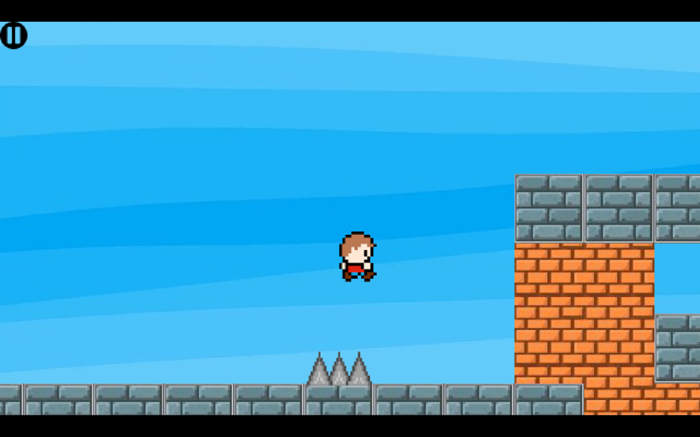
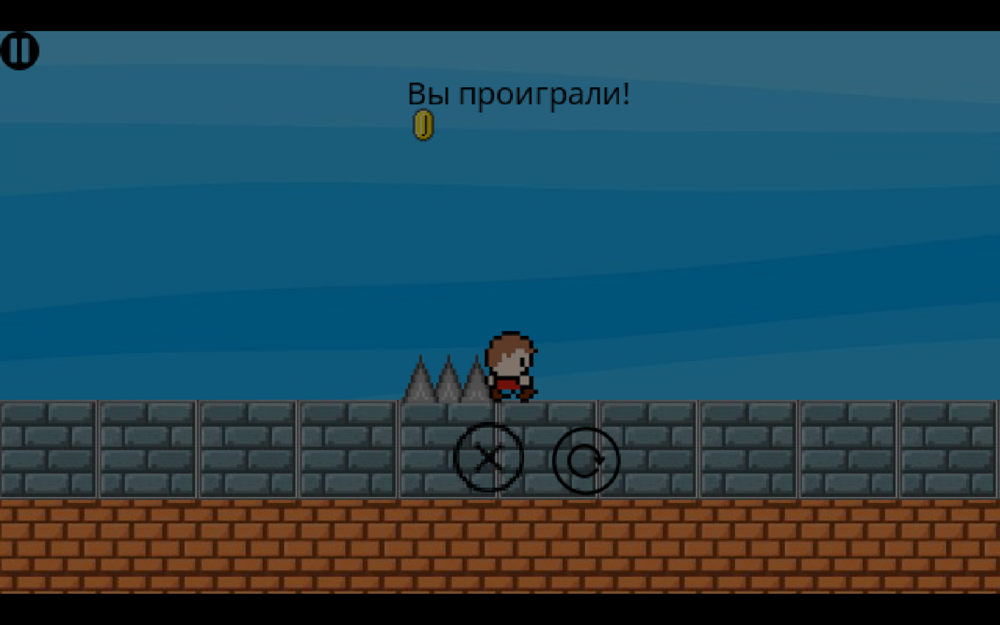
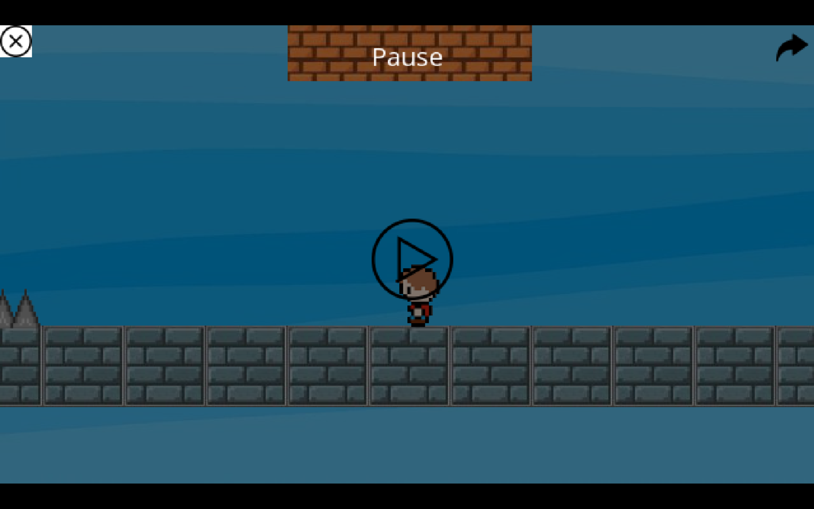
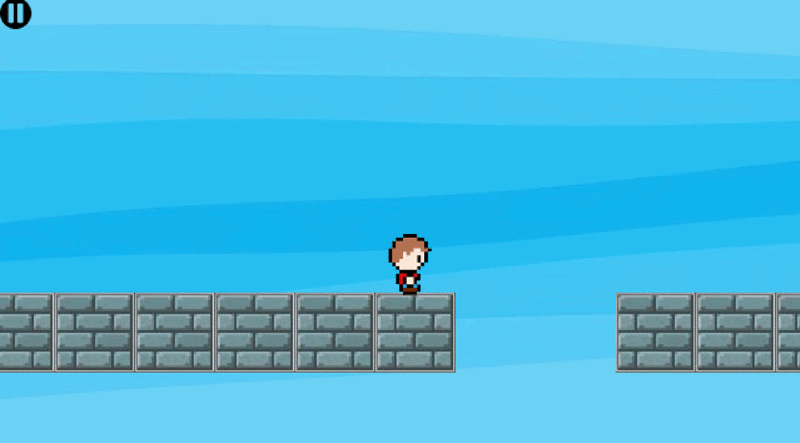

# 2D platformer written on Python, PyGame
[License: MIT](LICENSE)

Read this in other languages: [Russian/Русский](README.ru.md)

Read full documentation: [Documentation](Documentation.md)

- **One playable level** (more coming soon)
- **Dual language** - English and Russian

## Mechanics
- **Coyote time** - jump forgiveness after leaving a ledge
- **Jump buffer** - jump input buffering before landing
- **Pause menu**
- **Death menu**
- **Victory menu**
- **Debug mode** - show hitboxes (enable in settings)

## Controls
- A/D - movement
- SPACE - jump
- ESC - pause
- F1 - toggle fullscreen mode

## Gameplay - screenshots and GIFs









## Installation
1. Download `SIBGames.zip` 
2. Unzip the file
3. Open `SIBGames/pythonProject/`
4. Run `Main.exe` (no Python installation required)

## Requirements 
- **OS:** Windows 10/11
- **CPU:** 1.5 GHz
- **RAM:** 512 MB
- **GPU:** Any (DirectX 9 compatible)
- **Disk space:** 189 MB

## 📁 Project Structure
### JumpOverlord
```
SIBGames/
│
├── pythonProject/                    # Project root folder
│   ├── Main.py                       # Main game file (entry point)
│   ├── Main.spec                     # PyInstaller config (.exe build)
│   ├── objects.json                  # Game objects
│   │
│   ├── images/                       # Images (textures, buttons, flags, background)
│   ├── levels/                       # ASCII level files (.txt)
│   ├── fonts/                        # Fonts (OpenSans)
│   ├── pleft/                        # Player sprites (left movement)
│   └── pright/                       # Player sprites (right movement)
│
├── Documentation_screens/            # Code screenshots (5 appendices)
│   ├── Appendix_1/
│   ├── Appendix_2/
│   ├── Appendix_3/
│   ├── Appendix_4/
│   └── Appendix_5/
│
├── screenshots_gifs/                 # Screenshots and GIFs for README
│
├── .gitignore                        # Ignored files (build/, dist/, .idea/, etc.)
│
├── README.md                         # Project description (English)
├── README.ru.md                      # Project description (Russian)
│
├── DOCUMENTATION.md                  # Full documentation (English)
├── DOCUMENTATION.ru.md               # Full documentation (Russian)
│
├── LICENSE                           # MIT License
```
## 🙏 Thanks
- Python, Pygame
- Google Fonts (Open Sans)
- Flaticon, Iconfinder
- Various free sources (Pinterest, etc.)

## License
**MIT** — free to use, modify, and share.  
Designed as educational material for beginners.
